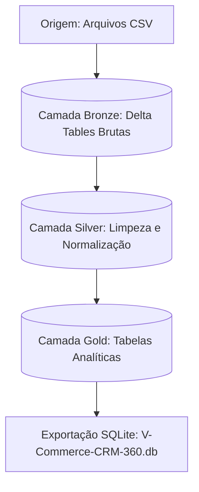

# 🛒 V-Commerce CRM 360

Plataforma inteligente e integrada de CRM 360 desenvolvida para o **RocketLab 2026 (Visagio)**. O projeto unifica engenharia de dados em grande escala, uma aplicação web moderna e um agente cognitivo de inteligência artificial conversacional de ponta.


## 📌 Sumário

1. [Visão Geral](#-visão-geral)
2. [Arquitetura de Dados (Medalhão)](#-arquitetura-de-dados-medalhão)
3. [Módulos do Sistema](#-módulos-do-sistema)
4. [Agente de IA (Text-to-SQL)](#-agente-de-ia-text-to-sql)
5. [Como Configurar e Executar](#-como-configurar-e-executar)
6. [Suíte de Testes](#-suíte-de-testes)
7. [Documentação e Links Úteis](#-documentação-e-links-úteis)


## 🔍 Visão Geral

A **V-Commerce** é uma grande varejista digital com mais de **50.000 clientes** cadastrados e uma base acumulada de mais de **300.000 pedidos**.

Para transformar essa massa de dados brutos em inteligência competitiva, o **V-Commerce CRM 360** centraliza dados de clientes, transações, produtos e atendimentos de suporte. A plataforma oferece:

* **Visão 360° do Cliente**: Perfis detalhados reunindo dados cadastrais, histórico de compras, métricas de satisfação (NPS), tickets de suporte e padrões de comportamento digital.
* **Painel Executivo (Dashboard)**: Indicadores-chave de desempenho (KPIs) de vendas estruturados por geografia, categoria de produtos e status dos pedidos.
* **Interface Conversacional**: Um agente de inteligência artificial integrado que responde a perguntas de negócios em tempo real, gerando e executando códigos SQL de leitura de forma segura e ágil.


## ⚡ Arquitetura de Dados (Medalhão)

A engenharia de dados do projeto é baseada na **Arquitetura Medalhão**, executada no **Databricks** com **PySpark** para garantir pipelines resilientes e escaláveis.



### 🟫 Camada Bronze
Ingestão de arquivos CSV brutos para tabelas Delta no Databricks, preservando o estado original das fontes e anexando metadados de auditoria.

* `bronze.tb_avaliacoes` (origem: `avaliacoes.csv`)
* `bronze.tb_catalogo_produtos` (origem: `catalogo_produtos.csv`)
* `bronze.tb_clickstream` (origem: `clickstream.csv`)
* `bronze.tb_clientes` (origem: `clientes.csv`)
* `bronze.tb_pedidos` (origem: `pedidos.csv`)
* `bronze.tb_suporte_tickets` (origem: `suporte_tickets.csv`)

### ⬜ Camada Silver
Etapa de limpeza, deduplicação, conformidade de tipos e padronização.
* Aplicação de regex para validação de e-mails.
* Padronização de strings categóricas para caracteres minúsculos e sem acentuação.
* Tratamento e nulificação de datas futuras ou fora de limites físicos.
* Substituição de valores faltantes por medianas amostrais.
* Normalização das relações de dispositivos de clientes em tabelas correlacionadas.

### 🟨 Camada Gold & Exportação SQLite
Consolidação analítica orientada a casos de uso do negócio. As tabelas da camada Gold alimentam a API do CRM e a base de conhecimento do agente de IA:

* `v_cliente_360`: Visão consolidada do comportamento do cliente, métricas de compras, NPS, suporte e navegação. Inclui classificação de segmentação de clientes (*Novo, Recorrente, Premium, Inativo*).
* `desempenho_produtos`: Indicadores agregados de vendas, volume de tickets gerados por item, NPS médio e taxa de conversão.
* `pedidos_por_cliente`: Linhas de pedidos individuais com detalhes de status de entrega e método de pagamento.
* `analise_tickets`: Detalhamento de problemas reportados, tempos de resposta e resolução por agente de suporte.
* `comportamento_digital`: Agregados comportamentais como taxa de abandono de carrinho e canal de acesso predominante.
* `historico_avaliacoes`: Notas de produtos e comentários detalhados dos consumidores.
* `kpi_por_categoria` / `kpi_por_estado` / `kpi_por_status`: Agrupados temporais (mês/ano) para alimentar os gráficos do dashboard.

> [!NOTE]  
> Ao final da camada Gold, o notebook `Rocket_silver_to_gold.ipynb` converte e exporta estas tabelas de forma estruturada para um banco relacional SQLite local (`V-Commerce-CRM-360.db`), garantindo portabilidade e latência ultra-baixa no servidor da aplicação.


## 📦 Módulos do Sistema

O repositório é organizado de forma modular para desacoplar as responsabilidades de engenharia de dados, backend, frontend e inteligência artificial.

```
├── backend/               # Servidor FastAPI com banco SQLite local
├── frontend/              # Aplicação React executada no Vite com TailwindCSS v4
├── ai-agent/              # Agente Text-to-SQL baseado no Gemini
└── data-engineering/      # Notebooks Databricks e especificações de Workflows
```

### 🖥️ Frontend (React & Vite)
A interface administrativa e operacional do CRM.
* **Componentes Modernos**: Construídos em React, TypeScript e estilizados de forma responsiva através do **Tailwind CSS**.
* **Visualização Avançada**: Gráficos analíticos dinâmicos usando **Chart.js** nas telas de desempenho comercial.

### ⚙️ Backend (FastAPI)
O barramento de serviços e acesso a dados.
* **Alta Performance**: API assíncrona baseada no framework **FastAPI** rodando sobre **Uvicorn**.
* **Persistência Segura**: Modelagem de dados integrada através de **SQLAlchemy** mapeando a base SQLite local.
* **Conectividade**: Endpoints otimizados de CRUD para gerenciamento de clientes, produtos, tickets de suporte e entrega de KPIs agregados.


## 🤖 Agente de IA (Text-to-SQL)

O módulo `ai-agent` é responsável por processar e responder perguntas complexas de negócio através do paradigma **Text-to-SQL**, convertendo linguagem natural em queries SQL dinâmicas de forma segura e autônoma.

### 🛠️ Tecnologias e Padrões
* **Modelo Utilizado**: Inteligência generativa fornecida pelo modelo `gemini-3.1-flash-lite-preview` através do novo SDK unificado `google-genai`.
* **Session Memory (`session_memory.py`)**: Gerenciamento de histórico de sessão para permitir conversas multi-turno e resolver termos relativos (ex: *"desses clientes, quem gastou mais?"*).
* **Context Enricher (`context_enricher.py`)**: Injeta dinamicamente no prompt do Gemini metadados relevantes do schema e amostras reais do banco de dados para evitar alucinações de nomes ou valores.
* **Safety Guardrails (`utils.py`)**: Camada rígida de segurança que analisa a query gerada e assegura que apenas instruções de leitura (`SELECT` ou `WITH`) sejam executadas, bloqueando de forma absoluta qualquer comando de escrita ou exclusão (ex: `DROP`, `DELETE`, `UPDATE`).


## 🚀 Como Configurar e Executar

Siga os passos abaixo para preparar os ambientes locais e executar os servidores do sistema.

### 1. Configuração Inicial e Variáveis de Ambiente

Crie uma cópia do arquivo de configurações na raiz do projeto:

```bash
cp .env.example .env
```

Abra o arquivo `.env` gerado e preencha as variáveis de ambiente necessárias. Você precisará de uma chave de acesso para a API do Gemini, que pode ser obtida gratuitamente em [Google AI Studio](https://aistudio.google.com/app/apikey).

### 2. Configurando e Executando o Backend

#### No Windows (PowerShell):

```powershell
cd backend
python -m venv .venv
.venv\Scripts\activate
pip install -r requirements.txt
python -m app.main
```

#### No macOS / Linux:

```bash
cd backend
python3 -m venv .venv
source .venv/bin/activate
pip install -r requirements.txt
python3 -m app.main
```

O servidor backend estará ativo no endereço `http://localhost:8000`. O banco de dados SQLite local `V-Commerce-CRM-360.db` já está incluído no diretório `backend` para uso imediato.

### 3. Configurando e Executando o Frontend

Abra um novo terminal na raiz do projeto e execute:

```bash
cd frontend
npm install
npm run dev
```

A interface web do CRM estará disponível para acesso no seu navegador através do endereço `http://localhost:5173`.


## 🧪 Suíte de Testes

O projeto conta com testes automatizados abrangentes tanto para os endpoints da API quanto para a lógica do agente de IA conversacional.

### Testes do Servidor (Backend)
Testa os endpoints da API, a conexão com o banco de dados e as operações de CRUD.

Para executá-los, ative o ambiente virtual no diretório `backend` e rode:

```bash
cd backend
pytest
```

### Testes do Agente (AI Agent)
Os testes do agente avaliam a capacidade de tradução de linguagem natural para SQL em uma grande diversidade de cenários de negócios (séries temporais, filtros, agregações de KPIs, resiliência de guardrails contra injeções SQL nocivas e perguntas fora do escopo).

Para executá-los, ative o ambiente virtual e execute o `pytest` dentro da pasta do agente:

```bash
cd ai-agent
pytest
```

> [!TIP]  
> A suíte de testes do agente de IA possui um limitador de requisições integrado (`time.sleep`) entre cada execução de teste para respeitar os limites de requisições por minuto impostos pelo plano de uso gratuito da API do Gemini.

## 📂 Documentação e Links Úteis

Abaixo estão centralizados os acessos e ferramentas de apoio ao desenvolvimento, gestão e design do ecossistema do projeto:

| Plataforma | Finalidade do Recurso | Link de Acesso |
| :--- | :--- | :--- |
| **Jira** | Gestão de Tarefas, Sprints e Backlog do Scrum | [Acessar Workspace 🔗](https://var-zea.atlassian.net/jira/software/projects/SCRUM/summary) |
| **Figma** | Protótipos de Interface, UI/UX e Fluxos de Telas | [Visualizar Design 🔗](https://www.figma.com/design/XCSyHO8HSz54SuqSAYzkDG/V-Commerce?node-id=0-1&t=brLlD7siVhVomxjl-1) |
| **Google Drive** | Repositório de Artefatos, Apresentações e Data Assets | [Abrir Pasta de Arquivos 🔗](https://drive.google.com/drive/folders/14wxZUj7KuyGFpH0fWI1lYd8QQTPfXDhb?usp=sharing) |
